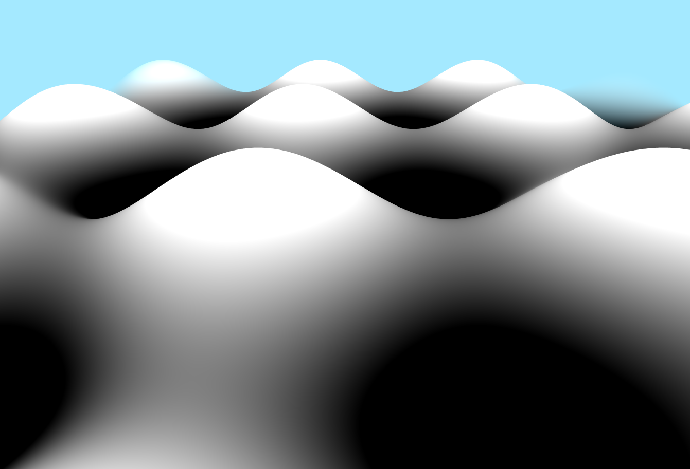
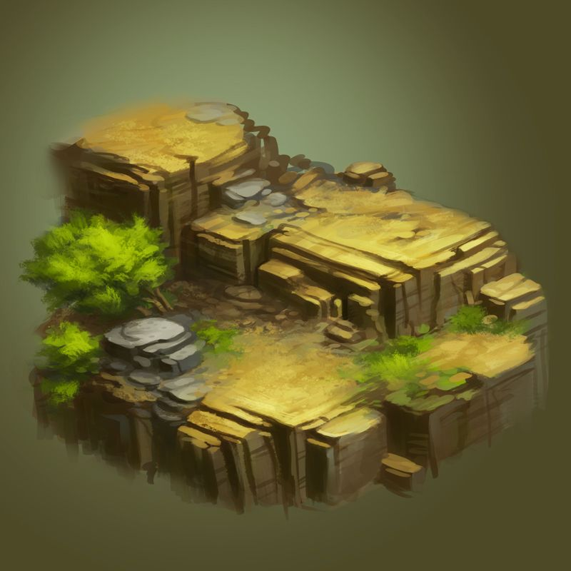
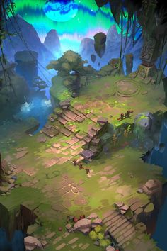
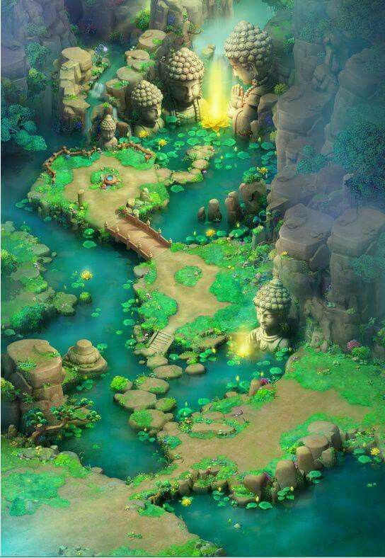

# CIS 566 Homework 1: Noisy Terrain

## Objective
- Continue practicing WebGL and Typescript
- Experiment with noise functions to procedurally generate the surface of a planet

## Base Code
The code we have provided for this assignment features the following:
- A subdivided plane rendered with a shader that deforms it with a sine curve
and applies a blue distance fog to it to blend it into the background. This
shader also provides a few noise functions that include "seed" input; this
value lets you offset the input vec2 by some constant value so that you can
get two different noise values for the same input position.
- A movable camera like the one provided with homework 0
- A keyboard input listener that, at present, listens for the WASD keys
and updates a `vec2` in the plane shader representing a 2D position
- A square that spans the range [-1, 1] in X and Y that is rendered with a
shader that does not apply a projection matrix to it, thus rendering it as the
"background" of your scene

When you run the program, you should see this scene:

## Assignment Requirements
- __(75 points)__ Modify the provided terrain shader so that it incorporates various noise
functions and noise function permutations to deform the surface and
modify the color of the subdivided plane to give it the appearance of
various geographic features. Your terrain should incorporate at least three
different types of noise (different permutations count as different types).
Here are some suggestions for how to use noise to generate these features:
  - Create a height field based on summed fractal noise
  - Adjust the distribution of noise values so they are biased to various height
  values, or even radically remap height values entirely!
  
  - Use noise functions on a broad scale to compute different terrain attributes:
    - Temperature
    - Moisture
    - Rainfall
    - Population
    - Mysticality
    - Volcanic activity
    - Urbanization
    - Storm intensity
    - Fog density (perhaps add some procedurally textured planes hovering above
      the ground)
    - Faction control in the war between the Ponies of Equestria and Manatees
    of Atlantis
  - Use the above attributes to drive visual features such as terrain height
  distribution, terrain color, water placement, noise type used to deform
  terrain, etc.
  - If you think of your terrain attributes as forming an N-dimensional space,
  you can carve out zones within that space for different kinds of environments
  and biomes, interpolating between the different kinds when you reach the
  boundary of a biome.
  - Your terrain doesn't have to be Earth-like; create any kind of outlandish
  environment you wish to!

- __(15 points)__ Add GUI elements via dat.GUI that allow the user to modify different
attributes of your terrain generator. For example, you could modify the scale
of certain noise functions to grow and shrink biome placement, or adjust the
age of your world to alter things like sea level and mountain height. You could
also modify the time of day of your scene through the GUI. Whichever elements
you choose to make controllable, you should have at least two modifiable
features.

- __(10 points)__ Following the specifications listed
[here](https://github.com/pjcozzi/Articles/blob/master/CIS565/GitHubRepo/README.md),
create your own README.md, renaming this file to INSTRUCTIONS.md. Don't worry
about discussing runtime optimization for this project. Make sure your
README contains the following information:
  - Your name and PennKey
  - Citation of any external resources you found helpful when implementing this
  assignment.
  - A link to your live github.io demo (refer to the pinned Piazza post on
    how to make a live demo through github.io)
  - An explanation of the techniques you used to generate your planet features.
  Please be as detailed as you can; not only will this help you explain your work
  to recruiters, but it helps us understand your project when we grade it!

## Inspiration
### Cliffs

[(Image Source)](https://i.pinimg.com/236x/a6/91/7c/a6917cbe80e81736058cdcfe60e90447.jpg)

### Stairs
 

Use a sawtooth / stepping function to create stairs. [(Image Source)](https://i.pinimg.com/originals/43/ba/5c/43ba5caaeed0f24b19bbbc16f884966c.jpg)

### Pond

Use any obj loader to load assets into your scenes. Be sure to credit the loader in your readme! [(Image Source)](https://i.pinimg.com/originals/13/2a/2a/132a2a2bde126d0993b9ea77955cc673.jpg)

## Useful Links
- [Implicit Procedural Planet Generation](https://static1.squarespace.com/static/58a1bc3c3e00be6bfe6c228c/t/58a4d25146c3c4233fb15cc2/1487196929690/ImplicitProceduralPlanetGeneration-Report.pdf)
- [Curl Noise](https://petewerner.blogspot.com/2015/02/intro-to-curl-noise.html)
- [GPU Gems Chapter on Perlin Noise](http://developer.download.nvidia.com/books/HTML/gpugems/gpugems_ch05.html)
- [Worley Noise Implementations](https://thebookofshaders.com/12/)

## Submission
Commit and push to Github, then submit a link to your commit on Canvas. Remember
to make your own README!

## Extra Credit (20 points maximum)
- __(5 - 20 pts)__ Modify the flat shader to create a procedural background for
your scene. Add clouds, a sun (or suns!), stars, a moon, sentient nebulae,
whatever tickles your fancy! The more interesting your sky, the more points
you'll earn!
- __(5 - 10 pts)__ Use a 4D noise function to modify the terrain over time, where time is the
fourth dimension that is updated each frame. A 3D function will work, too, but
the change in noise will look more "directional" than if you use 4D.
- __(10 - 20 pts)__ Create your own mesh objects and procedurally place them
in your environment according to terrain type, e.g. trees, buildings, animals.
- __(10 - 20 pts)__ Cast a ray from your mouse and perform an action to modify the terrain (height or color), making your environment paintable.
- __(? pts)__ Propose an extra feature of your own!
