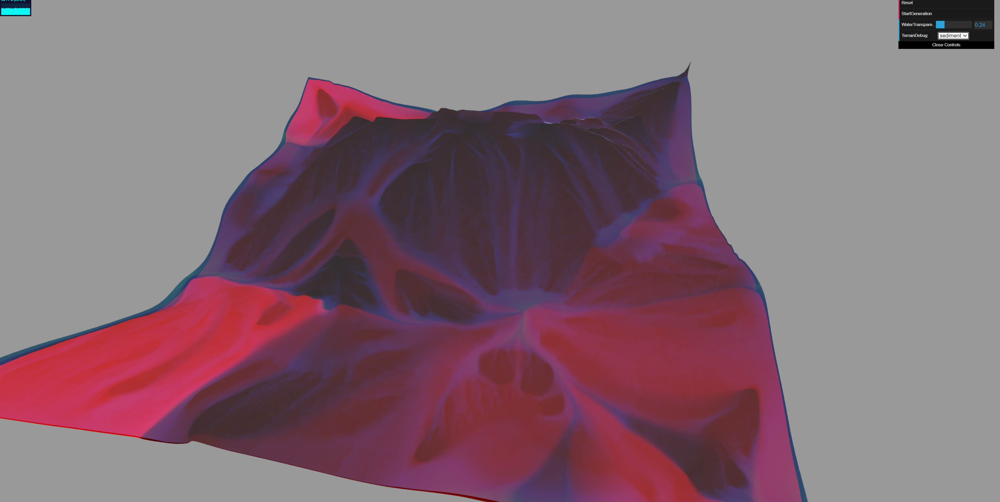
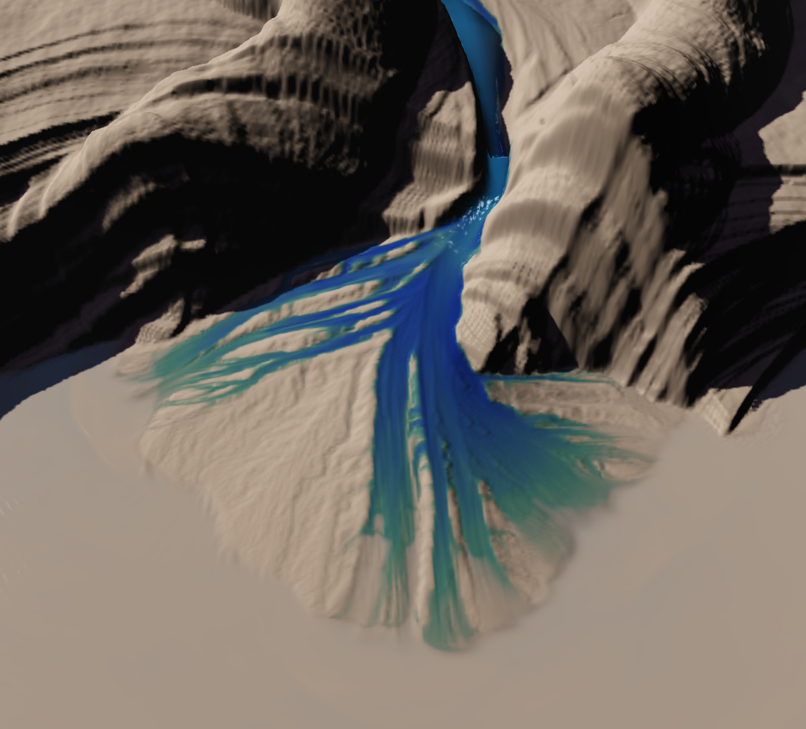

## Terrain hydraulic erosion simulation in WebGl


## [**Youtube Link**](https://www.youtube.com/watch?v=mHNzvRx9i_A)

## [**DEMO** (Chrome Recommended)]( https://lanlou123.github.io/Webgl-Erosion/)

### controls : 
- press button ```Start/Resume``` to the right top corner to start or resume the erosion sim, the simulation will happen in realtime
- press button ```Pause``` to pause the simulation
- press button ```Reset``` to reset simulation and start with a randomly generated base terrain
- use ```WaterTrabsparancy``` slider to control alpha of water
- use ```EvaporationDegree``` slider to control anomunt of evaporation you want each simulation step
- use ```RainDegree``` slider to control anomunt of Rain you want each simulation step
- use ```Kc``` slider to control Kc (erosion capacity constant)
- use ```Ks``` slider to control Ks (erosion dissolvating constant)
- use ```Kd``` slider to control Kc (erosion deposition constant)
- use the dropdown to check the debug views
- press right mouse button to rotate camera, press left mouse button to translate camera, use middle mouse to scale...
- press keyboard ```C``` to do terrain editions with brush, editions include : add/subtract for water and hight map for now, you can also adjust size of brush


### Terrain editor support


### Results after longer period of time


## Debug view images

### Sediment map

- 

### Velocity map

- 

### Water coverage map

- 

### Flux map

- 

### Delta like features on near flat terrain

- 


### Base terrain generation:

- The initial terrain was generated using FBM and domain warping as an option, you can choose randomrized base terrain by clicking "Reset" botton

### Erosion

#### In short, erosion sim is mainly based on ***Shallow water equation*** which is just the depth integration form of the famous viscous fluid equation Navier–Stokes equations, the major algorithm are based on paper [Fast Hydraulic Erosion Simulation and Visualization on GPU](http://www-ljk.imag.fr/Publications/Basilic/com.lmc.publi.PUBLI_Inproceedings@117681e94b6_fff75c/FastErosion_PG07.pdf) (erosion)

-  **Main theory** : following are some steps need to be followed sequentially according to the paper.

   - ***Increament water level*** : New water appears on the terrain due to two major effects: rainfall and river sources. For both types, we need tospecify the location, the radius and the water intensity (the amount of water arriving during ∆t). For river sources, the
location of the sources is fixed, for rain fall, all pixel have to be increment with water, the addition is simply : 
```d1(x,y) = dt(x,y) + deltaTime*rt(x,y)``` where rt(x,y) is the water arriving x,y per deltaTime.
   - ***Flow simulation*** :
      - Outflow flux computation : 
      as shown in the graph above, we need the in flow flux and out flow flux to compute overall volume change in current cell, as for flux, we need to calculate it through the height variation.
      the value of a flux in left direction, for example, can be calculated as 
      where height difference delta hL(x,y) can be calculated using  
      where K is a scaling factor to ensure the volume change doesn't exceed the current water height 
      
      - Water surface and velocity update:
      water height is basically the change of water volume, which can be calculated with ```deltaTimes*(fin-fout)/(cellsizeX*cellsizeY)``` 
      as for the velocity, the paper also gives:
      
   - ***Erosion and Deposition*** : 
      first thing in this step is to aquire the sediment capacity for current water volume, which is simply  , which is multiplication of terrain slope, capacity constant ```Kc``` and length of the current velocity
      second thing is to compare the current sediment with the capacity, if sediment > capacity, deposite some amount to current cell (Kd)
      else erode some from the current cell (Ks)
      
   - ***Sediment transportation*** : 
      semi-lagrangian method (back track in short) is applied to this step, the formula is  , bilinear interpolation need to be applied to achieve better results.
   
   - ***Evaporation***:
   a quite straight forward step, water will be evaporated with the increase of simulation time, and the rate of evaporation will gradually slow down as well.
      
-  **Simulation structure** entire simulation is achieved using a series of ping pong texture pairs each mapping to a spedific stage in the simulation process ，following are the texture pairs I used :
   -  
   - ```read_terrain_tex``` and ```write_terrain_tex``` : including terrain water information, corresponding to d and b in above graph : 
     -  **R** chanel : terrain height
     -  **G** chanel : water height
   - ```read_flux_tex``` and ```write_flux_tex``` : flux information in each cell, correspond to right half of above graph:
     -  **R** chanel : flux toward up direction in current cell (fT)
     -  **G** chanel : flux toward right direction in current cell (fR)
     -  **B** chanel : flux toward bottom direction in current cell (fB)
     -  **A** chanel : flux toward left direction in current cell (fL)
   - ```read_vel_tex``` and ```write_vel_tex``` : velocity map, simply used two chanels for velocity specification
   - ```read_sediment_tex``` and ```write_sediment_tex``` : sediment map, record the transporation and deposition of sediments, only one chanel is occupied for now
-  **Implementation** using the above textures, I put all of the major computation in shader to be excuted by GPU, each time the frame buffer will have specific color attachment for writing texture, and also shader will have uniform locations as read texture, after each time I write to a texture, I will swap the two textures inside the pair the written texture belongs to, in general, the texture flow are :  
   - Increament water level : ```hight map -----> hight map```
   - Flux map computation : ```hight map -----> flux map```
   - Water volume change and velocity field update : ```hight map + flux map -----> velocity map + hight map```
   - Deposite and erosion step, extra normal map is exported as well to save future calculation : ```hight map + velocity map + sediment map -----> sediment map + hight map + terrain normal map```
   - Lagrangian advection step : ```velocity map + sediment map -----> sediment map```
   - Water evaporation step : ```terrain map -----> terrain map```

### Future Plans:
- Better GUI & Visulization
- Thermal & glacial  erosion and muti-layered(rock/sand/etc) erosion

### Reference
- [Fast Hydraulic Erosion Simulation and Visualization on GPU](http://www-ljk.imag.fr/Publications/Basilic/com.lmc.publi.PUBLI_Inproceedings@117681e94b6_fff75c/FastErosion_PG07.pdf)

