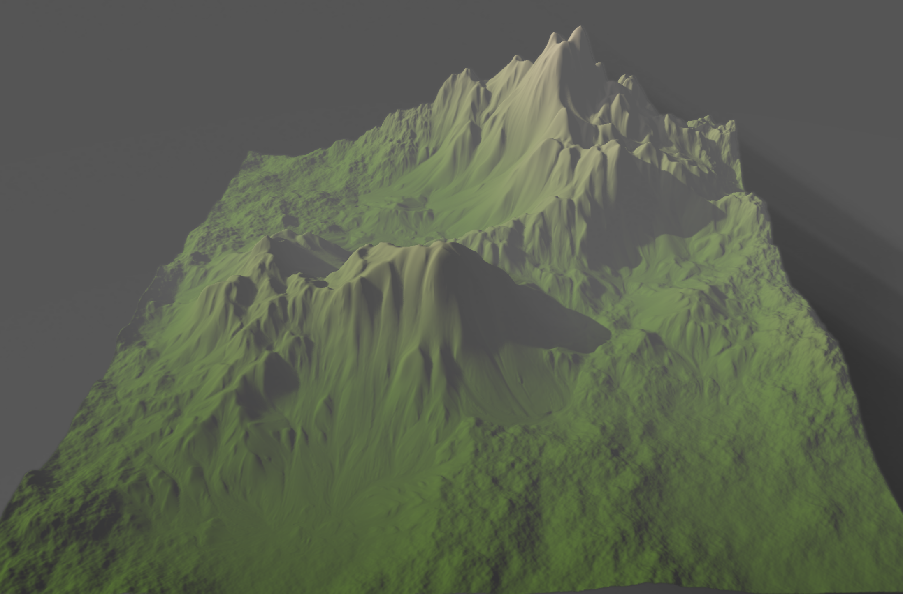
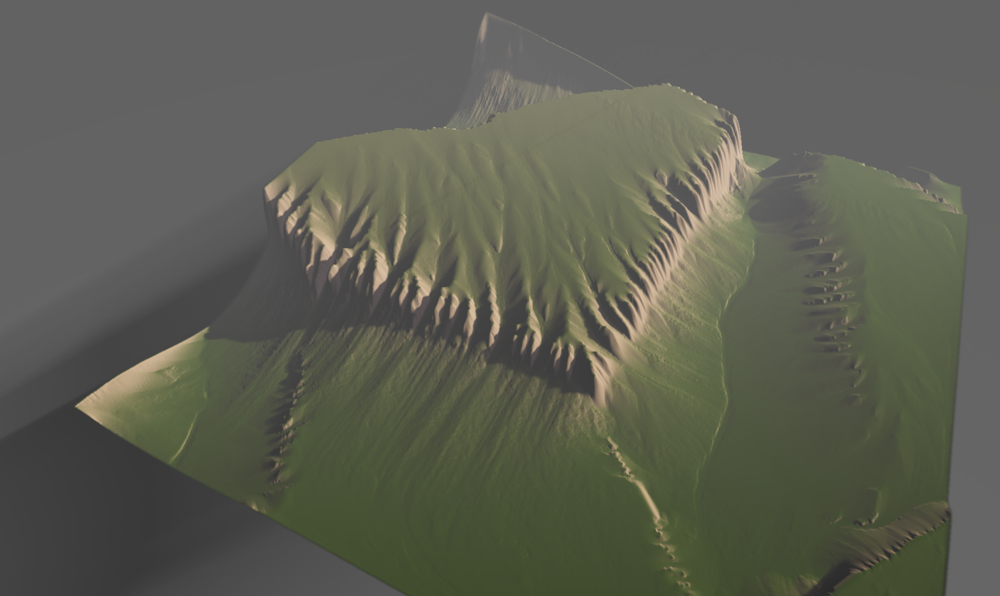
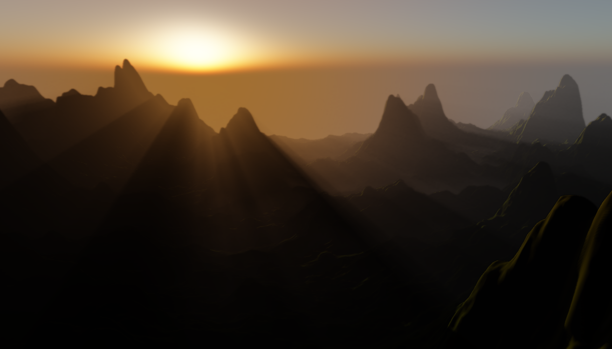
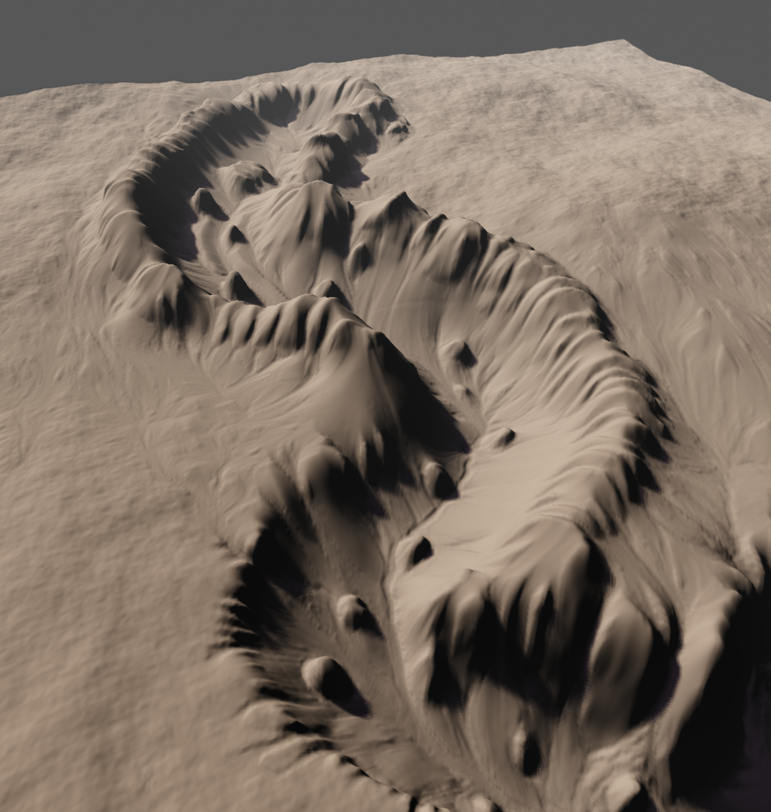

## Terrain erosion sandbox in WebGl



## controls : 

- press keyboard ```c``` to do terrain editions with brush, editions include : add/subtract for water and hight map for now, you can also adjust size of brush
- press keyboard ```r``` to place permanent water source. (note : 1 . press ```r``` again to remove permanent water source, 2 . after it's placed you can see a red circle marking the location, 3 . the size and strength of permanent water is equal to the brush size and strength the moment permanent water source is placed)
- press button ```Start/Resume``` to the right top corner to start or resume the erosion sim
- press button ```Pause``` to pause the simulation
- press button ```Reset``` to reset simulation and start with a new randomly generated base terrain
- use ```WaterTrabsparancy``` slider to control alpha of water
- use ```EvaporationDegree``` slider to control anomunt of evaporation you want each simulation step
- use ```Kc``` slider to control Kc (erosion capacity constant)
- use ```Ks``` slider to control Ks (erosion dissolvating constant)
- use ```Kd``` slider to control Kc (erosion deposition constant)
- use the dropdown to check the debug views
- press right mouse button to rotate camera, press left mouse button to translate camera, use middle mouse to scale...

## [**PLAY LIVE** (Chrome Recommended)]( https://lanlou123.github.io/Webgl-Erosion/)

## [**Demo Video showing sandbox feature**](https://youtu.be/Qly5emyyR_s)






## Note : MacOS currently unsupported, Recommended GPU is GTX 1060 and above

## update 10/1/2021 : 
- Algorithm update/fix : now erosion detail will be more accurate as I've choosen to disregard small water body's contribution to sediment advection, it used to create noises in sediment result because when water volume goes below numerical limitation of the sim, velocity will be contributing the same to advection regardless of water size...
## update 9/24/2021 : 
- Added option to change simulation resolution
## update 7/11/2021 : 
- permanent water source is added, you can pressed ```r``` to place it, see controls for details 
- added heatmeap for velocity magnitude in debug view, mapping color goes from blue to green then to red as the velocity size increases
- added MacCormack advection scheme for sediment advection, resulting in less numerical diffusion (referencing : ShaderX7 Advanced Rendering Techniques - starting page 207), you can find and toggle it on/off under ```erosionParameters``` in gui


### some screenshots
- New rain based Erosion examples (I lowered the threshold for talus angle) : 


- permanent water in a river vally

- river vally dries up after some erosion

- alluvial fan (or at least a similar one) formed at the mountain exit


### sediments advection in action 


### see [**detail.md**](detail.md) for implementation details


### Future Plans:
- Image(height map) I/O 
- muti-layered(rock/sand/etc) erosion
- PBR 
- adaptive simulation utilizing quadtree(or just tiles) for sim optimization
- Depth upsampling/downsampling for volumetric rendering optimization
- Better GUI & Visulization
- Terrain features like instaced tree placements
- other postprocessing effects (ray marched cloud for example, since ray marched Mie scattering is done, cloud should be fairly simple to work based on it)
- Biomes
- Eventual goal : Erosion based games, "FROM DUST" would be a good example

### Reference
- [Fast Hydraulic Erosion Simulation and Visualization on GPU](http://www-ljk.imag.fr/Publications/Basilic/com.lmc.publi.PUBLI_Inproceedings@117681e94b6_fff75c/FastErosion_PG07.pdf)
- [Interactive Terrain Modeling Using Hydraulic Erosion](https://cgg.mff.cuni.cz/~jaroslav/papers/2008-sca-erosim/2008-sca-erosiom-fin.pdf)
- [Volumetric Lights for Unity 5](https://github.com/SlightlyMad/VolumetricLights)
- ShaderX7 Advanced Rendering Techniques : starting page 207